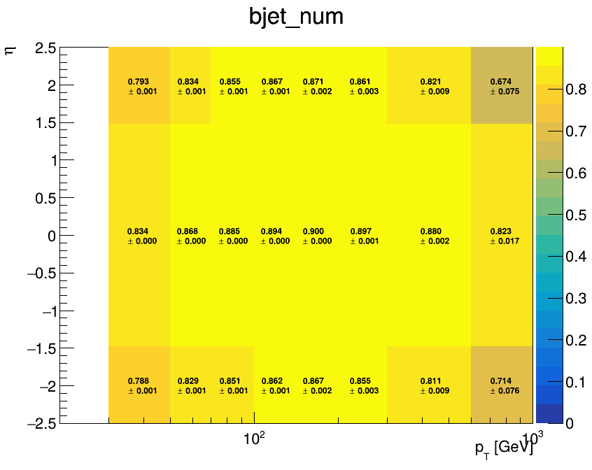

# 03 — Data, event weights and corrections

## Why this module exists

This module moves to a **real analysis-style configuration**, based on the 2022 dileptonic TTDMsimp setup.

Here you learn all the pieces:

- DATA datasets and trigger overlap removal;
- lepton working-point cuts and scale factors;
- MC event weights;
- b-tagging working points;
- b-tag efficiency maps;
- b-tagging scale-factor evaluation;
- how corrections are combined into `SFweight`;
- why helper C++ code sometimes has to be compiled before the main run.

The existing files in `Full2022v12/`, `data/`, `extended/` and `macros/` are the runnable example.

---

## 1. Start from the sample definition


### MC weight

In a real configuration the common weight contains reconstruction/filtering and scale-factor information. 
```
aliases['SFweight'] = {
    'expr': ' * '.join(['SFweight2l', 'LepWPCut', 'LepWPSF', 'btagSFbc', 'btagSFlight']), # used to apply leptons SFs
    'samples': mc
}

```

```
mcCommonWeight = 'XSWeight*METFilter_Common*SFweight'
```

This weighting is later applied to all the MC events.

---

## 2. Data streams and trigger overlap removal
```text
DataRun = [
    ['B','Run2022B-ReReco-v1'],
    ['C','Run2022C-ReReco-v1'],
    ['D','Run2022D-ReReco-v1'],
]

DataSets = ['MuonEG','SingleMuon','Muon','EGamma']

DataTrig = {
    'MuonEG'         : 'Trigger_ElMu' ,
    'SingleMuon'     : '!Trigger_ElMu && Trigger_sngMu' ,
    'Muon'           : '!Trigger_ElMu && (Trigger_sngMu || Trigger_dblMu)',
    'EGamma'         : '!Trigger_ElMu && !Trigger_sngMu && !Trigger_dblMu && (Trigger_sngEl || Trigger_dblEl)'
}
```

`DataRun` identifies run eras, `DataSets` identifies primary datasets, and `DataTrig` assigns trigger logic to each stream.

The negated trigger clauses are essential. The same physical collision can satisfy more than one trigger, so simply adding `MuonEG + Muon + EGamma` would double count events. The trigger expressions create an exclusive priority between datasets.

Before using new data periods, verify the available primary datasets and which streams replace older ones in that era.

---

## 3. Lepton working points

```text
# LepSF2l__ele_cutBased_MediumID_tthMVA_Run3__mu_cut_TightID_pfIsoLoose_HWW_tthmva_67
eleWP = 'cutBased_MediumID_tthMVA_Run3'
muWP  = 'cut_TightID_pfIsoLoose_HWW_tthmva_67'

aliases['LepWPCut'] = {
    'expr': 'LepCut2l__ele_'+eleWP+'__mu_'+muWP,
    'samples': mc + ['DATA'],
}

aliases['LepWPSF'] = {
    'expr': 'LepSF2l__ele_'+eleWP+'__mu_'+muWP,
    'samples': mc
}
```

The aliases configuration constructs names such as `LepCut2l__...` and `LepSF2l__...`.

Conceptually:

- `LepWPCut`: event passes the chosen electron/muon identification/isolation WP;
- `LepWPSF`: MC correction for the efficiency difference between data and simulation.

A *cut* decides whether the event is retained. A *scale factor* keeps the event and changes its statistical weight. Do not confuse the two.

---

## 4. B-tagging selection

The configuration separates:

1. **tagging decision** — compare the discriminator (`Jet_btagPNetB`, etc.) to a threshold;
```text
bAlgo = 'PNetB' # ['DeepFlavB','RobustParTAK4B','PNetB'] 
bWP    = 'medium'     # ['loose','medium','tight','xtight','xxtight']
#bSF   = 'deepjet'

# No b-tagged jets
aliases['bVeto'] = {
    'expr': 'Sum(CleanJet_pt > 20. && abs(CleanJet_eta) < 2.5 && Take(Jet_btag{}, CleanJet_jetIdx) > {}) == 0'.format(
        bAlgo, btagging_WPs[bAlgo][bWP]
    )
}
```
2. **MC correction** — evaluate a b-tag scale factor using jet flavour/kinematics and an efficiency map.
```text
for flavour in ['bc', 'light']:
    btagsf_tmp = 'btagSF_TMP' + flavour
    aliases[btagsf_tmp] = {
        'linesToProcess':[
            f'ROOT.gSystem.Load("{analysisRoot}/extended/evaluate_btagSF{flavour}_cc.so","", ROOT.kTRUE)',
            f"ROOT.gInterpreter.ProcessLine('btagSF{flavour} btag_SF{flavour} = btagSF{flavour}(\"{analysisRoot}/data/btag_eff/{btag_eff_file}\",\"{year}\",\"\");')"
        ],
        'expr': f'btag_SF{flavour}(CleanJet_pt, CleanJet_eta, CleanJet_jetIdx, nCleanJet, Jet_hadronFlavour, Jet_btag{bAlgo}, "{wp_map[bWP]}", {shift_str})',
        'samples' : mc,
    }
```

`bReq` and `nbjets` are selections/counts. They are not the SF themselves.

---

## 5. Where the efficiency map comes from

Go to:

```bash
cd ../data/btag_eff
ls
```

You will see `bTagEff.cc`, a shell helper and ROOT efficiency files.

The efficiency map answers a different question from the SF calibration: **given this simulated jet flavour and kinematics, how often does it pass the chosen tagger/WP?** The per-event b-tag weight needs these efficiencies to propagate tagging/mistagging probabilities correctly. [link](https://btv-wiki.docs.cern.ch/PerformanceCalibration/fixedWPSFRecommendations/#scale-factor-recommendations-for-event-reweighting)



---

## 6. Compile the b-tag helper code

From `Full2022v12`:

```bash
cd ../extended
root -l -b -q 'evaluate_btagSFbc.cc++'
root -l -b -q 'evaluate_btagSFlight.cc++'
cd ../Full2022v12
```

ROOT options:

- `root`: start ROOT;
- `-l`: do not show the splash logo;
- `-b`: batch mode, no GUI;
- `-q`: execute the command/file and quit;
- `file.cc++`: ACLiC-compile the C++ source and create a shared library (`*_cc.so`).

`aliases.py` later loads those libraries with `ROOT.gSystem.Load(...)` and instantiates the helper objects.

A compile-time test complaint that the evaluator object itself is not yet defined can occur during the separate compilation step; what matters is that the library is produced and the real alias initialization succeeds in the mkShapesRDF test.

Verify:

```bash
ls -lh *_cc.so
```

---

## 7. Fake background estimation

The Fake sample is a data-driven estimate of events containing nonprompt or misidentified leptons.
Instead of taking this background directly from MC, events from data are weighted according to the probability that a loose lepton also passes the tight lepton selection.

The fake-rate inputs are stored in:

```text
data/fakerate/<year>/
```

For example:

```text
data/fakerate/2022/
├── cutBased_MediumID_tthMVA_Run3/
│   ├── EleFR_jet25.root
│   ├── EleFR_jet35.root
│   ├── EleFR_jet45.root
│   └── ElePR.root
│
└── cut_TightID_pfIsoLoose_HWW_tthmva_67/
    ├── MuonFR_jet10.root
    ├── MuonFR_jet15.root
    ├── MuonFR_jet20.root
    ├── ...
    └── MuonPR.root
```

Here:
FR → fake rate
PR → prompt rate

The ROOT files contain two-dimensional maps in lepton (p_T) and (\eta).

The fake weight is exposed to mkShapesRDF through the fakeW alias:
```text
aliases['fakeW'] = {
    'linesToAdd': [
        f'#include "{analysisRoot}/extended/fake_rate_reader_class.cc"'
    ],
    'linesToProcess': [
        "ROOT.gInterpreter.ProcessLine("
        "'fake_rate_reader fr_reader = "
        'fake_rate_reader("2022", "Run3", "67", "nominal", 2, "std");'
        "')"
    ],
    'expr': 'fr_reader(...)',
    'samples': ['Fake'],
}
```

which is only evaluated only for `'samples': ['Fake']` because this weight is specific to the data-driven fake estimate.

In this context, we introduce the variables `PromptGenLepMatch2l`. For simulated samples, one also needs to know whether the reconstructed leptons come from prompt generator-level leptons.

This is what PromptGenLepMatch2l is used for.

Conceptually:
```text
reconstructed leptons
      ↓
match to generator-level prompt leptons
      ↓
PromptGenLepMatch2l
```
This way, applied to the mcCommonWeight, it can be used to enable prompt MC contributions, while the non-prompt/fake contributions are estimated exclusively by data-driven methods.

---

## 8. Jets in Horns


8. Jets in Horns

The so-called **\(\eta\) horns** are regions where an excess of low-\(p_T\) jets was observed in Run 3, especially in 2022.

The most likely explanation is an increased HCAL noise contribution due to PF rechit thresholds being set too low. The effect is therefore strongest for low-\(p_T\) jets and becomes less important at high \(p_T\).

In this analysis, jets in the horn region

\[
2.6 < |\eta| < 3.1
\]

with

\[
p_T < 50~\mathrm{GeV}
\]

are used to veto the **whole event**, rather than simply removing the jet. This is implemented through the noJetInHorn selection.

---

## 9. Run and validate

Compile and make the tiny test exactly as before:

```bash
mkShapesRDF -c 1
mkShapesRDF -o 0 -f . -b 0 -l 10
```

Then:

```bash
mkShapesRDF -o 0 -f . -b 1
mkShapesRDF -o 1 -f .
mkShapesRDF -o 2 -f .
mkPlot --onlyPlot cratio --showIntegralLegend 1 --fileFormats png
```

